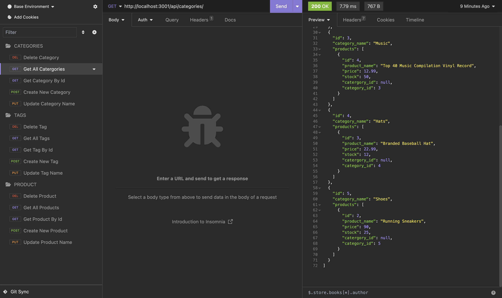

# e-commerce-backend-app
A back end application allowing you to perform CRUD operations on a database!

## Description
See a collection of products with their associated tags and categories that can be updated, deleted, created and viewed!

## Executing program
Website link: https://github.com/AyhaamB/e-commerce-backend-app

## Screenshot of Program

## How to video
https://drive.google.com/file/d/1UV1N5O8wT5SjiMVjIemWGW4AODXwCUHt/view?usp=sharing

## Help
Any advice for common problems or issues, email me at ayh132@gmail.com

## Authors
Ayhaam Baksh - Github: https://github.com/AyhaamB